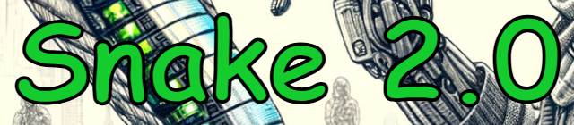
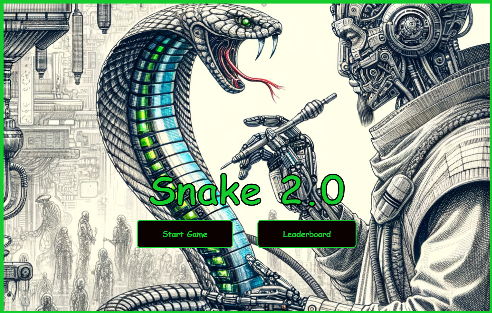
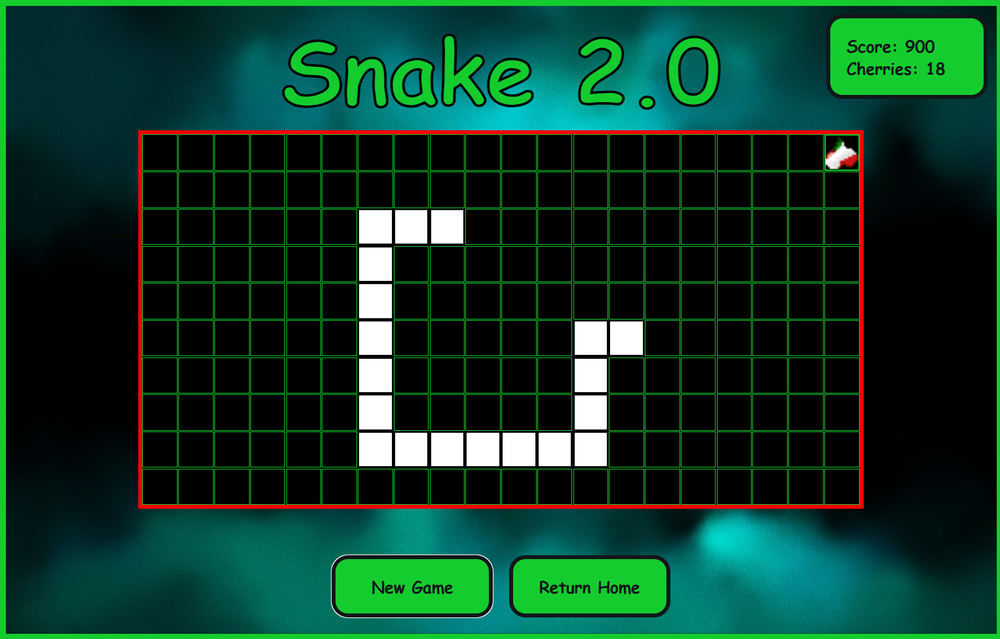
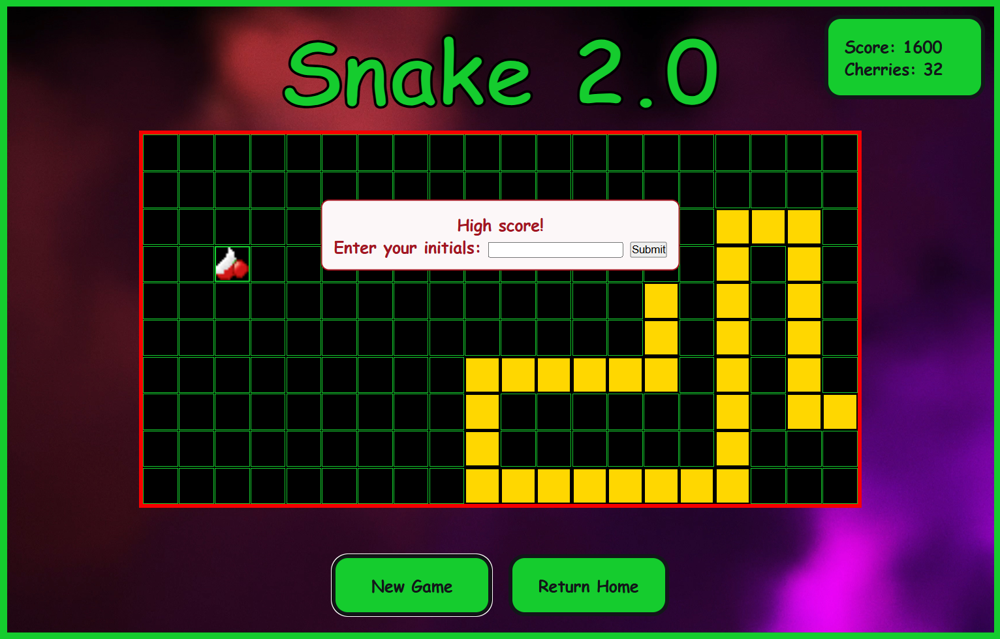
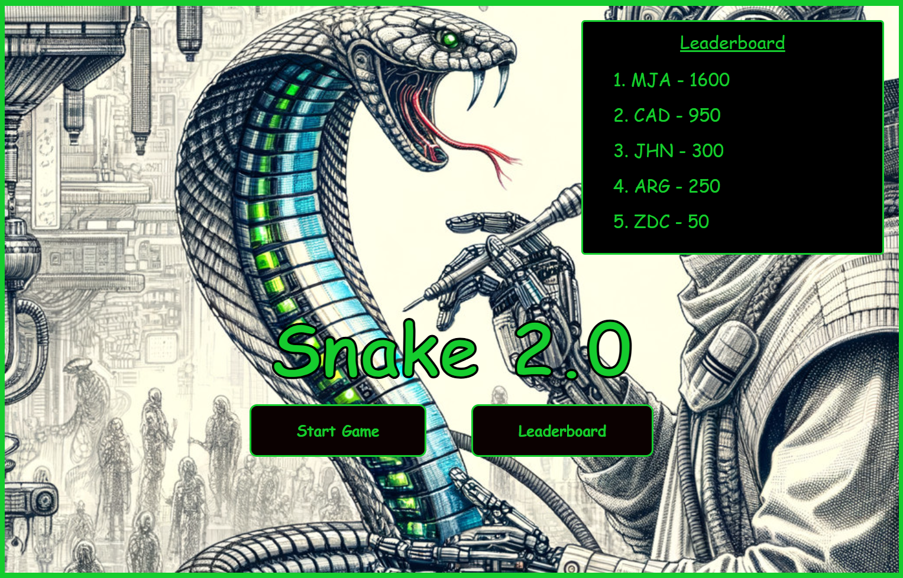

  

<h1 align="center"><strong>SNAKE 2.0</strong></h1>

 Created by <a href="https://www.linkedin.com/in/cloud9coding/">Michael Anderson</a>

  <a href="https://michael-anderson92.github.io/Snake-2.0-browser-game/">CLICK TO PLAY</a>

  
  

  
  

  

## 📄 Description
Snake 2.0 is an exciting twist on the classic snake game, offering a fun and challenging experience. Navigate the snake to collect cherries, which increase its length and speed, adding to the excitement. Avoid crashing into walls or your own tail to keep the game going. Aim for a high score and see your name on the leaderboard. Enjoy dynamic gameplay, a catchy soundtrack, and upcoming features like power-ups and customization options. Perfect for gamers of all ages!

## 🕹️ How to Play
Score points by collecting the single cherry that appears on the game board. Each cherry will increase the length of your snake. For every five cherries collected, the snake's speed will increase, adding to the challenge. The game ends if the snake crashes into a wall or its own body. Achieve a high score, and it will be displayed on the leaderboard within the start page.

## 📸 Screenshots

<table style="width:100%;">
  <tr>
    <td style="width:30%; vertical-align: top;">
      <strong>Description</strong>
    </td>
    <td style="width:70%; vertical-align: top;">
      <strong>Screenshot</strong>
    </td>
  </tr>
  <tr>
    <td style="width:30%; vertical-align: top;">
      <strong>Start Menu:</strong>
    </td>
    <td style="width:70%; vertical-align: top;">
      
    </td>
  </tr>
  <tr>
    <td style="width:30%; vertical-align: top;">
      <strong>Game Play:</strong>
    </td>
    <td style="width:70%; vertical-align: top;">
      
    </td>
  </tr>
  <tr>
    <td style="width:30%; vertical-align: top;">
      <strong>High Score:</strong>
    </td>
    <td style="width:70%; vertical-align: top;">
      
    </td>
  </tr>
   <tr>
    <td style="width:30%; vertical-align: top;">
      <strong>Leaderboardy:</strong>
    </td>
    <td style="width:70%; vertical-align: top;">
      
    </td>
  </tr>
</table>

## 💻 Technologies Used

## 🔥 Getting Started
Instructions

1. Press the Start Game button.

2. The snake and cherry will spawn in a random location within the grid. Don't worry, the snake will begin moving in a direction away from its nearest wall so you won't immediately crash. 😉

3. Move the snake around the grid using either the arrow keys or WASD keys.

4. Try to eat the cherries 🍒 when they spawn as this will add points to your total score. For every five cherries eaten, the snake's speed will increase to increase the challenge.

5. Be careful not to crash the snake into any of the walls or the snake's own body, as this will result in "GAME OVER" 💀 and your total score will be tallied.

6. If you manage to reach a high score, you will be given the opportunity to enter your initials and have it displayed within the leaderboard section on the home page. (Note: leaderboard section not completed at the time of this commit. Will be working properly at time of game deployment).

7. Feel free to click "new game" to reset the game, or return back to the game menu to check the leaderboard scores.

P.S. - I hope you like the sound track and effects. It's a work in progress and I'm hoping to improve the game experience in future updates!

  <h4>Hope you enjoy the game! 🐍</h4>

## 📡 Upcoming Features

[:x:] Special power up items for the snake such as: extra lives, invincibility, snake-length reduction.

[:x:] Obstacles within the grid to avoid during game. Some resulting in immediate death, others adding debuffs to the snake such as increased length or speed.

[:x:] Improved point system. Either adding other score items or increasing the score depending on how many cherries are collected.

[:x:] In-game track selection.

[:x:] Snake color customization.

[:x:] Sprites for snake animation.

[:x:] Mobile device deployment.
